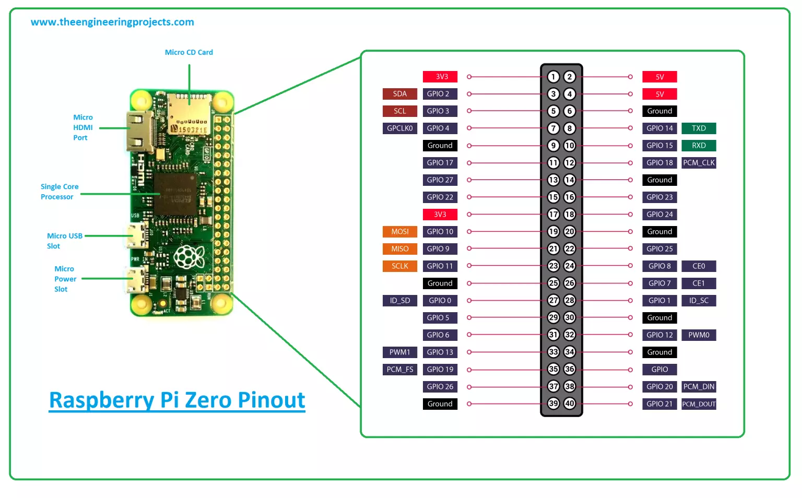

# Holding Tank Overflow Prevention
## using a Raspi Zero to prevent us from flooding our boat via SMS notifcations

## Description
For Chistmas

## Setup:
Clone the repo to your pi with
```
$ git clone ...
```
Then edit the rc.local file than runs on boot with
```
$ sudo nano /etc/rc.local
```
Before the `exit0` line at the end, add this to your rc.local
```
python3 /home/pi/overFlowDedection.py
```

Make sure that the file rc.local is executable otherwise it will not run:
```
$ sudo chmod +x /etc/rc.local
```
Now reboot your Raspberry Pi to test it:
```
$ sudo reboot
```

If you want to cancel the script boot, short pin 4 to ground. For setting up the sensor, connect the brown wire to 3.3V, blue to GRND, and yellow to pin 14. The black pin (signal mode select) can remain disconnected. 


Reference for sensor:
- Brown = Vcc (3.3V)
- Yellow = Signal Output (high when water sense, low when water low)
- Blue = GND
- Black = Signal Mode Select